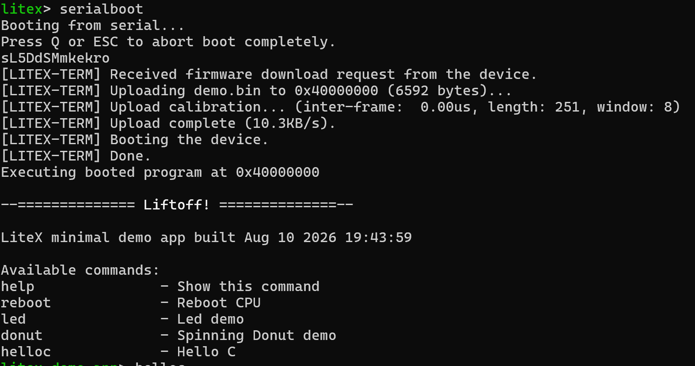

# Poradnik: wgrywanie przykładowego programu na VexRiscv

Ten poradnik opisuje, jak wgrać przykładowy program demonstracyjny na rdzeń **VexRiscv** (na przykładzie płytki Digilent PYNQ‑Z1). Aby móc skorzystać z kroków opisanych poniżej, wymagane jest wcześniejsze zrealizowanie **pierwszej części poradnika** (przygotowanie środowiska LiteX, konfiguracja projektu i połączenie z układem przez UART).

## 1. Wymagane komponenty

Do wykonania kroków opisanych w tej części poradnika potrzebne będzie:

- **WSL** (Windows Subsystem for Linux) — zalecane środowisko pracy, lub
- czysta dystrybucja **Linuksa** (jako alternatywa dla WSL),
- skonfigurowane już środowisko LiteX z pierwszej części poradnika,
- podłączony i zasilony układ (np. PYNQ‑Z1) połączony przez UART (patrz odpowiedni punkt dotyczący połączenia UART w pierwszej części poradnika).

## 2. Konfiguracja pamięci BRAM i budowanie dema

Aby na układzie było jakiekolwiek miejsce do zagospodarowania przez oprogramowanie, trzeba podczas budowania projektu jawnie zadeklarować pamięć **BRAM**:

```bash
python digilent_pynq_z1.py --integrated-main-ram-size=0x8000 --build
```

Flaga `--integrated-main-ram-size=0x8000` dodaje pamięć RAM (w projekcie widoczną jako `main_ram`), której wymaga dołączony do LiteX projekt demonstracyjny. Bez tej deklaracji build nie będzie posiadał pamięci potrzebnej do uruchomienia jakiegokolwiek programu.

### 2.1 Pliki CSR

Po zbudowaniu i skompilowaniu systemu do bitstreamu, w lokalizacji projektu pod `software/include/generated` pojawiają się pliki **CSR** (*Control and Status Registers*). Znajdują się w nich adresy **wszystkich peryferiów** podpiętych pod dany projekt — to właśnie za ich pomocą oprogramowanie komunikuje się z hardware'em na układzie:

```
C:\litex\litex-boards\litex_boards\targets\build\digilent_pynq_z1\software\include\generated
```

Przykładowo, dla builda skonfigurowanego zgodnie z pierwszą częścią poradnika, w pliku CSR dla PYNQ‑Z1 dostępny jest poniższy fragment dotyczący diod LED:

```c
/* IDENTIFIER_MEM Access Functions */

/* LEDS Access Functions */
static inline uint32_t leds_out_read(void) {
    return csr_read_simple((CSR_BASE + 0x1000L));
}
static inline void leds_out_write(uint32_t v) {
    csr_write_simple(v, (CSR_BASE + 0x1000L));
}
```

Te funkcje (`leds_out_read` / `leds_out_write`) można później wykorzystać bezpośrednio w kodzie C, np. do napisania prostego programu mrugającego diodą LED (LED blink) — wystarczy cyklicznie wywoływać `leds_out_write()` z odpowiednią wartością.

### 2.2 Deklaracja adresów pamięci

Oprócz plików CSR, istotna jest również deklaracja adresów poszczególnych obszarów pamięci. Przykładowo:

```c
#ifndef ROM_BASE
#define ROM_BASE 0x00000000L
#define ROM_BASE_VA 0x00000000L
#define ROM_SIZE 0x00020000
#endif

#ifndef SRAM_BASE
#define SRAM_BASE 0x10000000L
#define SRAM_BASE_VA 0x10000000L
#define SRAM_SIZE 0x00002000
#endif

#ifndef MAIN_RAM_BASE
#define MAIN_RAM_BASE 0x40000000L
#define MAIN_RAM_BASE_VA 0x40000000L
#define MAIN_RAM_SIZE 0x00008000
#endif

#ifndef CSR_BASE
#define CSR_BASE 0xf0000000L
#define CSR_BASE_VA 0xf0000000L
#define CSR_SIZE 0x00010000
#endif
```

Powyższe definicje wskazują adresy bazowe oraz rozmiary poszczególnych obszarów pamięci: pamięci ROM (bootloader), pamięci SRAM, głównej pamięci RAM (`main_ram`, zadeklarowanej w kroku 2 flagą `--integrated-main-ram-size`) oraz obszaru rejestrów CSR. Poprawna deklaracja tych adresów jest kluczowa — bez niej nie da się w ogóle wgrać ani uruchomić kodu aplikacji na układzie, ponieważ system nie będzie wiedział, gdzie w pamięci ma umieścić i wykonać program.

### 2.3 Budowanie projektu demo

```bash
litex_bare_metal_demo --build-path=/mnt/c/litex/litex-boards/litex_boards/targets/build/digilent_pynq_z1
```

W wyniku otrzymujemy plik `demo.bin`.

## 3. Wgrywanie kodu na układ (UART z poziomu WSL)

Do wgrania skompilowanego oprogramowania potrzebne jest narzędzie `litex_term`, dostępne w WSL. Układ musi być podłączony, zasilony i połączony przez UART — dla projektu `digilent_pynq_z1` wymagany jest konwerter USB-UART podpięty pod **PMOD_A** (patrz odpowiedni punkt dotyczący połączenia UART w pierwszej części poradnika).

### 3.1 Przekierowanie USB do WSL (`usbipd`)

WSL domyślnie nie ma bezpośredniego dostępu do portów USB/COM widocznych w Windows. Aby to umożliwić, na Windows należy zainstalować narzędzie **usbipd** — pozwala ono przekierować wybrane urządzenie USB do WSL.

> ⚠️ **Uwaga:** po przekierowaniu urządzenie przestaje być widoczne jako port COM po stronie Windows.

Listujemy dostępne urządzenia:

```powershell
PS C:\Users\Ihor> usbipd list

Connected:
BUSID  VID:PID    DEVICE                              STATE
1-2    1c7a:0587  EgisTec Touch Fingerprint Sensor     Not shared
1-3    3277:0010  Integrated Camera                    Not shared
2-2    0403:6001  USB Serial Converter                 Shared
2-3    13d3:3568  MediaTek Bluetooth Adapter            Not shared

Persisted:
GUID   DEVICE
```

> ⚠️ `usbipd` może zgłosić ostrzeżenie, że filtr `USBPcap` jest niekompatybilny z tym narzędziem — w takiej sytuacji polecenie `bind` trzeba wywołać z flagą `--force`.

Przekierowujemy ruch z konwertera USB-UART (tu: `BUSID 2-2`, uzyskany z powyższego `list`) do WSL:

```powershell
usbipd bind --busid 2-2
```

Po przekierowaniu, w WSL pod `ls /dev/tty*` powinien pojawić się nowy port (np. `/dev/ttyUSB0`).

### 3.2 Wgrywanie przez `litex_term`

Mając widoczny port, wgrywamy skompilowane oprogramowanie:

```bash
litex_term /dev/ttyUSB0 --kernel=demo.bin
```

Po uruchomieniu polecenia otrzymujemy dostęp do terminala LiteX BIOS. W konsoli wpisujemy komendę:

```
litex> serialboot
```

`serialboot` wgrywa oprogramowanie wskazane wcześniej flagą `--kernel` i uruchamia je na układzie.



Z poziomu terminala można wybrać jeden z dostępnych przykładowych programów demo — np. miganie diodami LED (`led`) lub kręcący się donat (`donut`). Domyślnie kod skompilowany jest w czystym C.

## 4. Kompilacja w C++

Jeśli program ma być skompilowany jako C++ zamiast C, należy ustawić zmienne środowiskowe wskazujące na katalog builda i katalog SoC:

```bash
export BUILD_DIR=/mnt/c/litex/litex-boards/litex_boards/targets/build/digilent_pynq_z1
export SOC_DIRECTORY=/mnt/c/litex/litex/litex/soc
```

Następnie wchodzimy do katalogu `demo`, czyścimy poprzedni build i budujemy z flagą `WITH_CXX=1`:

```bash
cd demo
make clean
make WITH_CXX=1
```

Flaga `WITH_CXX=1` jest odczytywana w `Makefile` i przełącza kompilację na C++. Wgrywanie odbywa się dokładnie tak samo jak w [pkt. 3](#3-wgrywanie-kodu-na-układ-uart-z-poziomu-wsl).

## 5. Własny (customowy) projekt

Mając dostępne adresy peryferiów w plikach CSR (`include/generated`, patrz [pkt. 2](#2-konfiguracja-pamięci-bram-i-budowanie-dema)), można napisać własny program — np. miganie diodą LED.

Aby go uruchomić:

1. Do katalogu `demo` dodajemy własny plik `main.cpp` (zamiast domyślnego `main.c`).
2. Podmieniamy `Makefile` na wersję dołączoną w załączniku (obsługującą kompilację z `main.cpp`).
3. Budujemy ponownie:

```bash
make clean
make
```

4. Wgrywamy program tak samo jak w [pkt. 3](#3-wgrywanie-kodu-na-układ-uart-z-poziomu-wsl).

> ⚠️ **Uwaga:** po wgraniu własnego programu dioda LED zacznie migać, ale sterownik UART zostanie nadpisany — kolejne wgrywanie kodu na układ nie będzie już możliwe bez ponownego uruchomienia płytki. Aby wgrać kolejny program, **zrestartuj płytkę**.

---

## Przydatne linki

- [LiteX – repozytorium i dokumentacja instalacji](https://github.com/enjoy-digital/litex/wiki/Installation)
