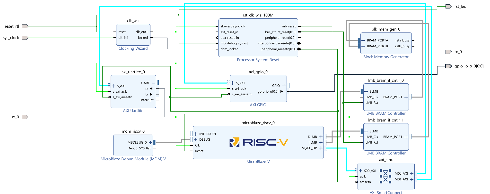
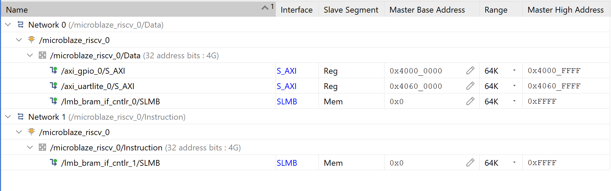
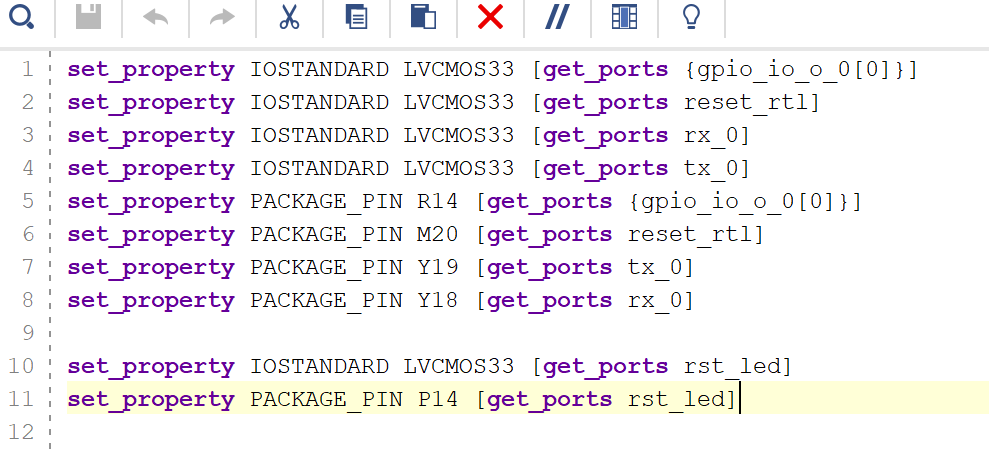
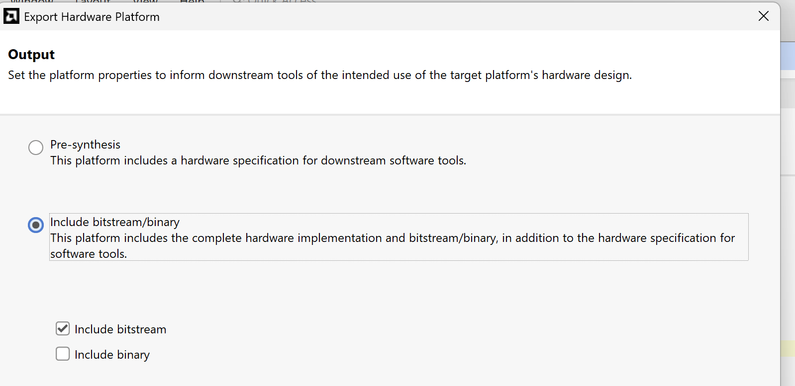

# 01 – Konfiguracja Vivado: MicroBlaze V (RISC-V) do wygenerowania bitstreamu

Instrukcja krok po kroku, jak zbudować w Vivado minimalny softprocesor **MicroBlaze V** (RISC-V) działający wyłącznie w logice programowalnej (**PL**), bez użycia procesora sprzętowego (PS). Demonstracja jest wykonana na **PYNQ-Z1**, ale ten sam projekt można odtworzyć na dowolnym układzie AMD/Xilinx.

Efektem jest plik **`.bit`** (bitstream) oraz **`.xsa`** (opis sprzętu), które są wejściem do drugiej części: [02-vitis.md](02-vitis.md).

## Spis treści

1. [Wymagania](#wymagania)
2. [Utworzenie projektu](#1-utworzenie-projektu)
3. [Schemat blokowy](#2-schemat-blokowy)
4. [Adresacja](#3-adresacja)
5. [Constraints](#4-constraints)
6. [Synteza, implementacja, bitstream i eksport XSA](#5-synteza-implementacja-bitstream-i-eksport-xsa)

## Wymagania

| Element | Wersja / typ |
|---|---|
| Płytka FPGA | PYNQ-Z1 (lub inny układ Xilinx) |
| Vivado | 2025.2 |
| Vitis | 2025.2 (część 2) |
| Adapter UART–USB | np. Pmod USB-UART |

## 1. Utworzenie projektu

1. Utwórz nowy projekt Vivado dla swojego układu (tu: PYNQ-Z1).
2. Utwórz nowy **Block Design**.

## 2. Schemat blokowy

Dodaj do schematu następujące bloki:

- `MicroBlaze V` (microblaze_riscv)
- `AXI UART Lite`
- `AXI GPIO`
- `MicroBlaze Debug Module V` (MDM V)
- `Block Memory Generator`
- `LMB BRAM Controller` – **dwie sztuki**

Następnie uruchom **Run Block Automation** oraz **Run Connection Automation** (zielone paski u góry diagramu). Vivado doda samodzielnie:

- `AXI SmartConnect`
- `Clocking Wizard`
- `Processor System Reset`
- zewnętrzne porty `sys_clock` (wejście zegara) i `reset_rtl` (wejście resetu)

### Konfiguracja bloków

#### MicroBlaze V (`microblaze_riscv_0`)

Po dodaniu bloku otwiera się okno konfiguracji z wyborem presetu:

| Preset | Zastosowanie |
|---|---|
| **Microcontroller** | Minimalny rdzeń, mały zasób logiki, pamięć lokalna (LMB). Do prostych aplikacji bare-metal. |
| **Real-time** | Rdzeń nastawiony na deterministyczne, szybkie reakcje (m.in. obsługa przerwań, opcjonalnie cache). |
| **Application** | Rozbudowany rdzeń (cache, MMU) przeznaczony pod system operacyjny, np. Linux. |

W tym projekcie:

- Preset: **Microcontroller**
- Architektura: **32-bit**
- Debug interface (`Debug connection`): **Serial**
- Włączone oba interfejsy pamięci lokalnej:
  - `Enable Local Memory Bus Instruction Interface`
  - `Enable Local Memory Bus Data Interface`

Dzięki nim można podłączyć pamięć BRAM na instrukcje i dane.

#### AXI UART Lite (`axi_uartlite_0`)

- Port `S_AXI` podłącz do `AXI SmartConnect` (`M00_AXI` lub `M01_AXI`).
- Porty `rx` i `tx` wystaw jako zewnętrzne (**Make External**):
  - `rx` → zewnętrzne wejście (`rx_0`),
  - `tx` → zewnętrzne wyjście (`tx_0`).
- **Baud rate: 9600**.

Do tych pinów podłączysz adapter UART–USB, aby odczytywać komunikaty wysyłane przez softprocesor.

#### AXI GPIO (`axi_gpio_0`)

- `All Outputs` (same wyjścia),
- `GPIO Width` = **1** (jedna dioda LED; można zwiększyć),
- port `GPIO_IO_[0:0]` wystaw jako zewnętrzny (**Make External**) – będzie podłączony do LED w constraints,
- port `S_AXI` podłącz do `AXI SmartConnect` (`M00_AXI` lub `M01_AXI`). Jeśli brakuje portu `M01_AXI`, zwiększ liczbę portów master w konfiguracji `AXI SmartConnect`.

#### MicroBlaze Debug Module V (`mdm_riscv_0`)

Blok **kluczowy**: bez niego projekt się zbuduje, ale nie da się wgrać kodu przez JTAG z Vitis.

- `MBDEBUG_0` → port `DEBUG` w `microblaze_riscv_0`,
- `Debug_SYS_Rst` → port `mb_debug_sys_rst` w `Processor System Reset`.

#### Block Memory Generator (`blk_mem_gen_0`)

- `Memory Type`: **True Dual Port RAM**
- `BRAM_PORTA` → jeden `LMB BRAM Controller`
- `BRAM_PORTB` → drugi `LMB BRAM Controller`
- Porty `rsta_busy` i `rstb_busy` mogą pozostać niepodłączone.

#### LMB BRAM Controller (×2)

| Kontroler | Port `SLMB` | Port `BRAM_PORT` |
|---|---|---|
| `lmb_bram_if_cntlr_0` | `DLMB` z MicroBlaze V | `BRAM_PORTA` |
| `lmb_bram_if_cntlr_1` | `ILMB` z MicroBlaze V | `BRAM_PORTB` |

#### Clocking Wizard (`clk_wiz`)

- `clk_out1` = **100 MHz**

### Porty zewnętrzne

| Port | Kierunek | Opis |
|---|---|---|
| `sys_clock` | wejście | Zegar płytki |
| `reset_rtl` | wejście | Reset. Podłączony do resetu `Clocking Wizard`, `Processor System Reset` oraz do LED `rst_led`. **Stan wysoki blokuje procesor.** |
| `rx_0` | wejście | Odbiór UART |
| `tx_0` | wyjście | Nadawanie UART |
| `rst_led` | wyjście | Świeci, gdy reset jest aktywny (procesor nie pracuje) |
| `gpio_io_o_0[0:0]` | wyjście | LED sterowany przez softprocesor |

### Poprawny schemat połączeń

## 3. Adresacja

W zakładce **Address Editor** skonfiguruj adresy peryferiów AXI i kontrolerów pamięci:

| Interfejs | Adres bazowy | Zakres |
|---|---|---|
| `microblaze_riscv_0/Data` → `axi_gpio_0/S_AXI` | `0x4000_0000` | 64K |
| `microblaze_riscv_0/Data` → `axi_uartlite_0/S_AXI` | `0x4060_0000` | 64K |
| `microblaze_riscv_0/Data` → `lmb_bram_if_cntlr_0/SLMB` | `0x0` | 64K (`0x0`–`0xFFFF`) |
| `microblaze_riscv_0/Instruction` → `lmb_bram_if_cntlr_1/SLMB` | `0x0` | 64K (`0x0`–`0xFFFF`) |

Pamięć danych i instrukcji muszą mieć **ten sam zakres** (`0x0`–`0xFFFF`).

## 4. Constraints

1. Wygeneruj **HDL Wrapper** dla schematu blokowego (*Create HDL Wrapper*, opcja *Let Vivado manage wrapper*) i ustaw go jako Top.
2. Otwórz **Elaborated Design** i przypisz porty do fizycznych pinów swojej płytki.

Dla PYNQ-Z1 plik constraints znajdziesz w repo: [`constraints/pynq-z1.xdc`](constraints/pynq-z1.xdc).

| Port | Pin PYNQ-Z1 | Uwagi |
|---|---|---|
| `gpio_io_o_0[0]` | R14 | LED LD0 |
| `reset_rtl` | M20 | Przełącznik SW0 |
| `rst_led` | P14 | LED LD1 |
| `rx_0` | Y18 | PMOD JA |
| `tx_0` | Y19 | PMOD JA |

> **Uwaga:** zegar `sys_clock` jest zwykle przypisywany automatycznie, jeśli projekt utworzono z użyciem board file PYNQ-Z1. Jeśli Vivado zgłasza brak przypisania, odkomentuj sekcję zegara w pliku XDC.
>
> **Uwaga:** linie UART są skrzyżowane – `tx_0` z FPGA musi trafić do wejścia RX adaptera, a `rx_0` do jego wyjścia TX. Sprawdź opis pinów swojego adaptera.

## 5. Synteza, implementacja, bitstream i eksport XSA

1. Uruchom kolejno: **Run Synthesis** → **Run Implementation** → **Generate Bitstream**.
   Powstaje plik `.bit` (np. `design_1_wrapper.bit`), czyli logika całego projektu w PL.
2. Wyeksportuj opis sprzętu: **File → Export → Export Hardware**.
3. W oknie wyboru zaznacz **Include bitstream** (opcja *Include bitstream/binary*) i wybierz lokalizację zapisu.

Plik **`.xsa`** to opis sprzętu, na podstawie którego Vitis wygeneruje platformę (BSP) z definicjami peryferiów i pamięci.

### Wynik tej części

- `design_1_wrapper.bit` – bitstream
- `design_1_wrapper.xsa` – opis sprzętu (z bitstreamem)

## Dalej

Przejdź do: **[02-vitis.md](02-vitis.md)** – programowanie mikrokontrolera w Vitis.
