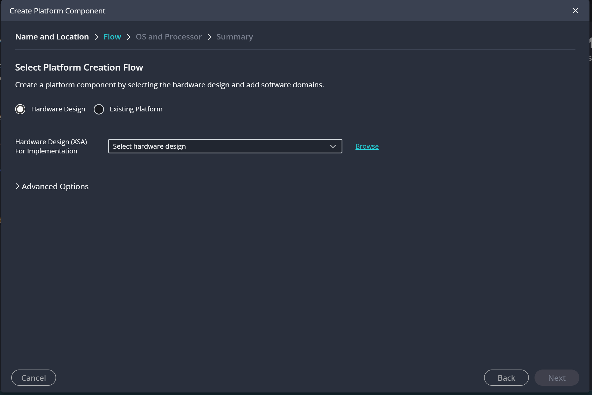
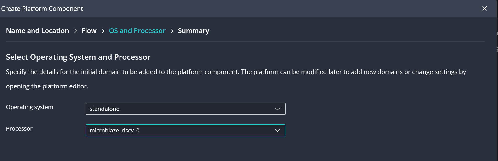
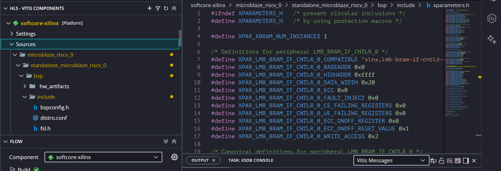
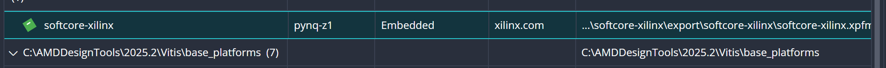
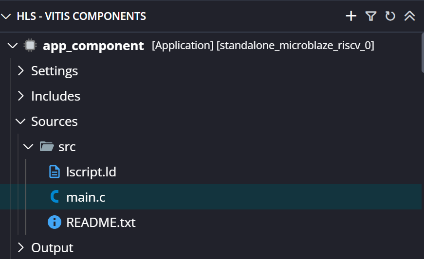
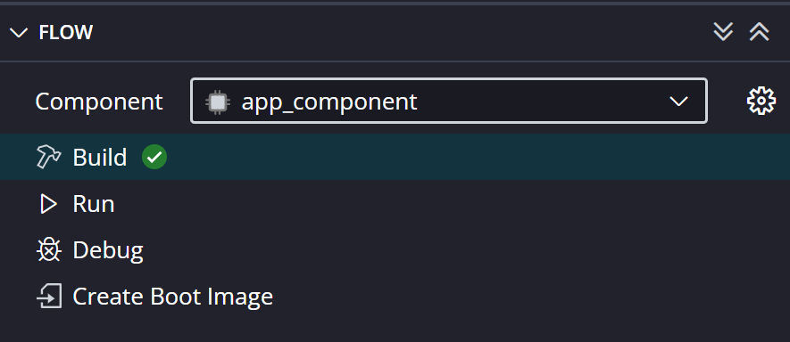

# 02 – Programowanie w Vitis: aplikacja bare-metal na MicroBlaze V (RISC-V)

Druga część instrukcji. Zakłada, że masz już gotowy bitstream i plik XSA z części pierwszej: [01-vivado.md](01-vivado.md).

Na końcu uzyskasz działającą aplikację bare-metal, która:

- miga diodą LED podłączoną do AXI GPIO,
- wysyła komunikat `=== Direct GPIO Blink ===` przez UART (PMOD).

## Spis treści

1. [Wymagania](#wymagania)
2. [Utworzenie platformy z XSA](#1-utworzenie-platformy-z-xsa)
3. [Utworzenie aplikacji](#2-utworzenie-aplikacji)
4. [Kod w C](#3-kod-w-c)
5. [Build](#4-build)
6. [Wgranie bitstreamu i programu (XSDB)](#5-wgranie-bitstreamu-i-programu-xsdb)
7. [Walidacja](#6-walidacja)
8. [Rozwiązywanie problemów](#rozwiązywanie-problemów)

## Wymagania

- Vitis 2025.2
- Pliki z części 1: `design_1_wrapper.bit` oraz `design_1_wrapper.xsa`
- Płytka PYNQ-Z1 z kablem USB (JTAG/zasilanie)
- Adapter UART–USB (np. Pmod USB-UART) i terminal szeregowy (np. PuTTY)

## 1. Utworzenie platformy z XSA

1. Uruchom Vitis 2025.2 i wybierz **Create Platform Component**.
2. Podaj nazwę i lokalizację platformy.
3. W kroku **Select Platform Creation Flow** wybierz **Hardware Design** i wskaż swój plik `.xsa` (przycisk **Browse**).

   

4. W kroku **OS and Processor** ustaw:
   - Operating system: `standalone`
   - Processor: `microblaze_riscv_0`

   

5. Zatwierdź w **Summary**.

Na podstawie opisu sprzętu Vitis utworzy komponent **Platform** z odpowiednimi zależnościami (BSP) dla Twojego softprocesora, jego peryferiów i pamięci.

Dostępne zasoby (adresy, nazwy instancji) znajdziesz w pliku `xparameters.h`:

```
<platforma>/microblaze_riscv_0/standalone_microblaze_riscv_0/bsp/include/xparameters.h
```



Na tej podstawie piszesz kod odwołujący się do peryferiów.

## 2. Utworzenie aplikacji

1. Kliknij **+** obok nazwy Workspace i wybierz **Application Component**.
2. W kroku wyboru platformy wskaż swoją platformę, czyli plik **`.xpfm`** utworzony w poprzednim kroku.

   

3. Dokończ kreator.

Powstanie nowy komponent (np. `app_component`). W `Sources/src/` znajdziesz:

- `lscript.ld` – skrypt linkera łączący program z pamięcią układu,
- `README.txt`.



## 3. Kod w C

W katalogu `src/` utwórz plik `main.c` i wklej zawartość z repo: [`src/main.c`](src/main.c).

Kod odwołuje się bezpośrednio do rejestrów peryferiów:

| Peryferium | Adres bazowy |
|---|---|
| AXI GPIO | `0x4000_0000` |
| AXI UART Lite | `0x4060_0000` |

Wypisuje `=== Direct GPIO Blink ===` przez UART i miga LED w pętli. Adresy muszą zgadzać się z tym, co ustawiono w **Address Editor** w Vivado (patrz `xparameters.h`).

## 4. Build

1. W panelu **FLOW** wybierz komponent aplikacji (np. `app_component`).
2. Kliknij **Build**.



Jeżeli build zgłasza błędy w skrypcie linkera, kliknij prawym przyciskiem nazwę komponentu i wybierz **Reset Linker Script**. Vitis sam wygeneruje poprawny `lscript.ld`.

Po udanym buildzie plik `.elf` znajdziesz w katalogu `build/` komponentu (np. `build/app_component.elf`). Nazwa zależy od nazwy Twojego komponentu.

## 5. Wgranie bitstreamu i programu (XSDB)

### Przygotowanie sprzętu

- Podłącz PYNQ-Z1 do komputera i włącz zasilanie.
- Ustaw zworkę trybu bootowania tak, aby płytka **nie bootowała z karty SD** (np. na JTAG).
- Przełącznik `reset_rtl` (SW0) musi być w **stanie niskim**. Stan wysoki = procesor w ciągłym resecie.
- Podłącz adapter UART–USB do złącza PMOD.

### Konsola XSDB

Otwórz konsolę: **Vitis → XSDB Console**.

#### Krok 1: połącz się i wgraj bitstream

```tcl
connect
fpga -f "SCIEZKA/DO/design_1_wrapper.bit"
after 2000
```

#### Krok 2: wybierz rdzeń

Najpierw sprawdź listę targetów:

```tcl
targets
```

Przykładowy wynik na PYNQ-Z1 (są też rdzenie ARM z PS, których tu nie używamy):

```
  1* APU
  2  ARM Cortex-A9 MPCore #0 (Running)
  3  ARM Cortex-A9 MPCore #1 (Running)
  4  xc7z020
  5  BSCAN JTAG at USER2
  6  RISC-V at USER2
  7  Hart #0 (Running)
```

Softprocesor jest widoczny jako **`RISC-V at USER2`** z rdzeniem **`Hart #0`**. Nie nazywa się `microblaze`, więc filtr `*microblaze*` zwróci `no targets found`.

Wybierz rdzeń:

```tcl
targets -set -filter {name =~ "Hart #0"}
```

#### Krok 3: zatrzymaj procesor, wgraj program i uruchom

```tcl
stop
rst -processor
dow "SCIEZKA/DO/app_component/build/app_component.elf"
con
```

> `rst -processor` jest opcjonalne. Jeśli zgłosi błąd, pomiń to polecenie.

### Pełna sekwencja

```tcl
connect
fpga -f "SCIEZKA/DO/design_1_wrapper.bit"
after 2000
targets -set -filter {name =~ "Hart #0"}
stop
rst -processor
dow "SCIEZKA/DO/twojego.elf"
con
```

Ścieżki podawaj z ukośnikami `/` (także w Windows).

## 6. Walidacja

Po wgraniu bitstreamu i programu (przy `reset_rtl` w stanie niskim):

- **LED** podłączony do `gpio_io_o_0` powinien **migać powoli**,
- po podłączeniu adaptera UART–USB otwórz terminal (np. PuTTY) na właściwym porcie COM z parametrami:
  - **Baud rate: 9600**, 8 bitów danych, brak parzystości, 1 bit stopu (8N1),
  - powinien pojawić się komunikat:

```
=== Direct GPIO Blink ===
```

## Rozwiązywanie problemów

| Objaw | Możliwa przyczyna / rozwiązanie |
|---|---|
| Procesor nie startuje, świeci `rst_led` | `reset_rtl` jest w stanie wysokim. Ustaw przełącznik w stan niski. |
| Nie widać `Hart #0` / `RISC-V at USER2` w `targets` | Bitstream nie został wgrany, lub w projekcie brakuje bloku **MDM V** (patrz część 1). |
| Błędy linkera przy buildzie | Prawy przycisk na komponencie → **Reset Linker Script**. |
| Brak tekstu w terminalu | Sprawdź baud rate (9600), wybrany port COM oraz skrzyżowanie linii RX/TX. |
| Płytka bootuje z karty SD | Ustaw zworkę trybu bootowania na JTAG. |
| Filtr `*microblaze*` nic nie zwraca | To normalne. Użyj `Hart #0` (patrz krok 2). |

---

Poprzednia część: [01-vivado.md](01-vivado.md)
